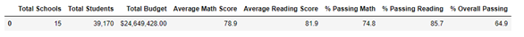
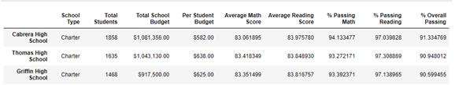
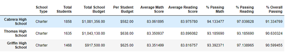
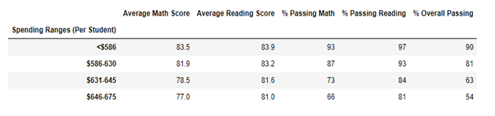
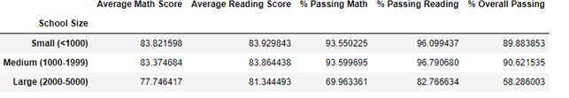
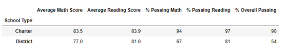

# School-Analysis  

## Overview of the School District Analysis
Analysis of district-wide test results. Student math and reading score data was cleaned and analyzed to determine the percentage of students who passed both math and reading, as well as this data related to the per student spending. While completing the analysis for school districts, it was needed to remove Thomas High School 9th graders scores while an inquire was made into curcumstances surrounding their testing data. This anaylsis is a comparision of the data with and without Thomas High School. 

## Results 
**District Summary Affects**
The district summary is not effected by the removal of the 9th graders from Thomas High School.  

**School Summary Affects**

**Thomas High School Affects**

The tables below demonstates the difference when excluding the Thomas High Schools 9th grade students Reading and Math scores. In this table, the Thomas High School scores without the 9th, slight decrease, for example in Overall Passing from 90.94 to 90.63. Thomas High School Overall Passing placement does not change significantly, the impact was minimal. 

**Affects on Math & Reading Scores by:**
**Grade**
The scores by school size are not effected by the removal of the 9th graders at Thomas High School. 

**Spending**
Since we did not remove the students from the data base, but mearly removed their scores there is no effect on the per student spending by the removal of the 9th grade scores at Thomas High School. 

     
**School Size**
The scores by school size are not effected by the removal of 9th grade scores at Thomas High School.  Both charts are the same. 

**School Type**
The scores by school type are not effected by the removal of 9th grade scores at Thomas High School. 

## Summary
Overall, the changes in the results by removing Thomas High 9th grade scored as minimul and not statistically significant. The most notable changes in the data when Thomas High School 9th graders where removed:

    - **Change 1**:  Thomas High School Math scores dropped slighty, with % Passing Math going from 93.27 to 93.19

    - **Change 2**: Average Reading scores at Thomas High School actually went up, going from 83.84 to 83.90

    - **Change 3**: Overall Passing Rate at Thomas High School decreased from 90.94 to 90.63

    - **Change 4**: For the entire district, Overall Passing Rate dipped from 65 to 64.9